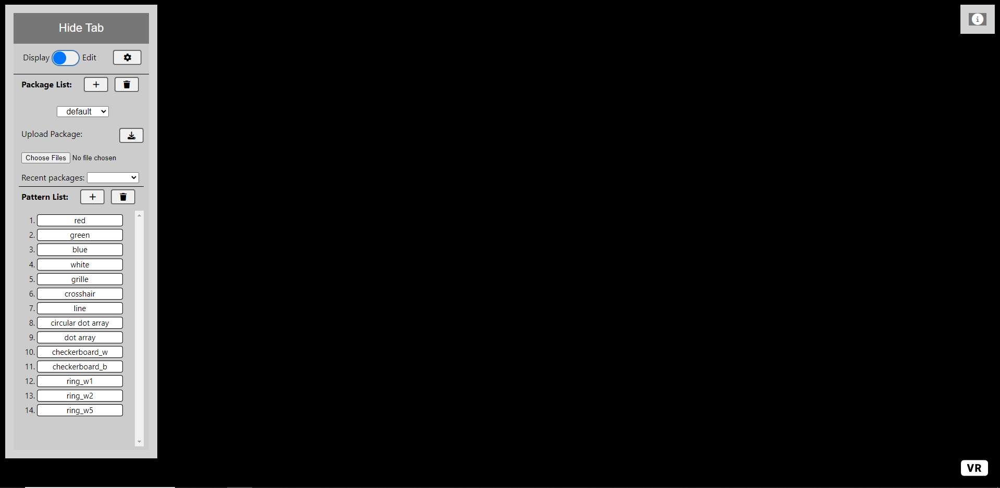
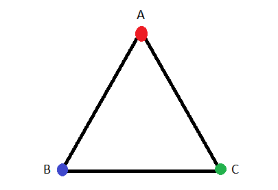

# Directions For Use: #
The Custom Pattern Tool allows for the creation, editing, and saving of a pattern or groups of patterns.

## Displaying Patterns

### Provided Patterns
- Default: A blank pattern that can be quickly edited
- Red: A solid red background
- Green: A solid green background
- Blue: A solid blue background
- White: A solid white background
- Grille Pattern: A black and white background

### Selecting a Pattern
To select a pattern, first ensure that the checkbox for the pattern under ***Pattern List*** has been checked. Then select the desired pattern from the ***Pattern Display*** dropdown. 

### Adding a Pattern
A pattern a can be added using the ***Add Pattern*** button. A name for the added pattern can be specified using textbox above the ***Add Pattern*** button.

### Removing a Pattern
Using the ***Remove Pattern*** button, the currently displayed pattern can be removed.

### Selecting Multiple Patterns
To select multiple patterns, check all of the desired checkboxes under ***Pattern List***. 
**The order that the patterns are selected in will be the display order!**
The current pattern can be rotated through using the up or down arrows on the keyboard.

### Displaying the Desired Pattern
To display the pattern, hit the ***VR*** button in the bottom right hand corner.
[**Check the demos folder for some basic editable patterns!**](./demos)

### Saving and Uploading a Group of Patterns
Multiple patterns can be saved together by hitting the ***Save Selected Patterns*** button. This will save all currently selected patterns from the ***Pattern List***.
To upload a group of patterns, press the ***Upload Patterns*** button and select the desired file. 

## Editing Patterns

### Uploading a Pattern
A single pattern can be uploaded to the current pattern. If a file containing multiple patterns is uploaded, it will be rejected.

### Adding Entities

To add an entity, make sure the slider at the top left of the webpage is set to ***Edit Pattern*** then move the slider below it to the ***Add Entity***.  

Then, select the type of entity you would like to add using the ***Type of entity*** dropdown and hit the ***Add to Pattern*** button.

Entities will spawn at a random position within the editor camera field of view with a random color.

***Entities may appear skewed in the editor but this affect is corrected on the headset. Do not stack entities, it will result in [z-fighting].(https://en.wikipedia.org/wiki/Z-fighting)***

#### Types of Entities
- Circle
- Plane
- Triangle
- Gradient
- Checkerboard
- Grille

### Editing Entities

**In order to access the editor one or more entities must be added to the pattern**. The editing bar can be hidden by pressing the ***Hide Settings*** button.

Once entities have been added to the pattern, change the slider to ***Edit Entity***.

To change the entity being edited, either click on the entity or select the desired entity from the dropdown labeled ***Current Entity***.
Entity ID's are automatically generated with the format **\<name of entity\>\<number of entities of this type previously created\>**.  

Examples: circle0, checkerboard4, plane20.

The current entity can be removed by hitting the ***Remove from Pattern***. The entire pattern can be reset by hitting the ***Reset Pattern*** button.

### Saving the Pattern
To save the pattern, press the ***Save Pattern*** button located at the bottom of the editor tab. The pattern is saved as an editable JSON file. Uploaded textures are preserved without image compression.

### Background Color
To change the background color, select a new color or enter the hexadecimal code of the desired color.

### Universal Entity Settings
#### Position: (x deg, y world units)
To edit the position, locate the position text boxes under **Universal Entity Settings**. The left box refers to the x position and the y position.  

The position of an entity refers to where its center point is located. The editor interfaces the three axis in different manners. 
Positional data is calculated based on a cylinder that encompasses the camera. The radius of this cylinder cannot be changed, however the cylinder has an infinite height. The x and z axes are responsible for horizontal positioning. The y axis controls the vertical position. 

- x-axis: 
   - This axis is in terms of **degrees** where 1 degree references 1 degree of clockwise rotation away from the fixed camera center on the cylinder.
- y-axis: 
   - This axis is in terms of **world units** where 1 world unit is equal to 1 meter in 3D space. 
- z-axis: 
   - **The z-axis is NOT editable by users.** The location on the z-axis is automatically calculated based on the x-axis angle.

The reason that the radius of the cylinder is not editable is due to the fact that all entities are 2-dimensional. Changing their depth would essentially have the same effect as making entities smaller or larger.

#### Rotation: θ deg
To edit the rotation, locate the text box labeled ***Rotation*** under **Universal Entity Settings**.

For this program, the rotation of an entity refers to rotation around the **z-axis only**. The axis of rotation is located at the center point of entity. The unit for rotation is **degrees** where 1 degree refers to one degree of rotation about the axis of rotation.

#### Color: #HEXCODE
To edit the color, locate the color selector labeled ***Color*** under **Universal Entity Settings**.

Select a color using the color slider or input the desired color in hexadecimal format.

***For checkerboards and grilles, the alternate color will always be black***

### Entity Specific Settings
#### Circle 
- Radius (m): 
   - The unit for radius is world units where 1 world unit is equal to 1 meter in 3D space.
- Border Size: 
   - The unit for border size is world units where 1 world unit is equal to 1 meter in 3D space. By default, the border size is set to be equal to the radius of the circle, meaning the entity is entirely filled in.

#### Plane
- Texture: 
   - There are some textures built into the site. [They can be found here.](./textures) Textures can also be uploaded as JPGS or PNGS and added to the list of available textures in the pattern. 
   - Applying a texture will automatically scale the plane to fit the aspect ratio.
- Height (m): 
   - The unit for height is world units where 1 world unit is equal to 1 meter in 3D space.
- Width (m): 
   - The unit for width is world units where 1 world unit is equal to 1 meter in 3D space.
- Border Size: 
   - The unit for border size is world units where 1 world unit is equal to 1 meter in 3D space. By default, the border size is set to be equal to the radius to the smallest dimension present of the plane, meaning the entity is entirely filled in.

#### Triangle

- Vertex A (x m,y m):
   - Position of vertex A in relation to the center point of the entity. The coordinates are in world units where 1 world unit is equal to 1 meter in 3D space.
- Vertex B (x m,y m):
   - Position of vertex B in relation to the center point of the entity. The coordinates are in world units where 1 world unit is equal to 1 meter in 3D space.
- Vertex B (x m,y m):
   - Position of vertex C in relation to the center point of the entity. The coordinates are in world units where 1 world unit is equal to 1 meter in 3D space.

#### Gradient
- Individual Bar Height (m): 
   - The unit for height is world units where 1 world unit is equal to 1 meter in 3D space.
- Indivdual Bar Width (m): 
   - The unit for width is world units where 1 world unit is equal to 1 meter in 3D space.
- Number of Bars:
   - The number of bars in the gradient, the default is 32.
   - The color is divided by the number of bars to determine the color of each bar.

#### Checkerboard
- Tile size (m): 
   - The unit for width and height of tiles is world units where 1 world unit is equal to 1 meter in 3D space.
- Number of Rows: 
   - The number of rows in the checkerboard, the default is 16.
- Number of Columns:
   - The number of columns in the checkerboard, the default is 16.

#### Grille
- Individual Bar Height (m): 
   - The unit for height is world units where 1 world unit is equal to 1 meter in 3D space.
- Indivdual Bar Width (m): 
   - The unit for width is world units where 1 world unit is equal to 1 meter in 3D space.
- Number of Bars:
   - The number of bars in the grille, the default is 32.

### Other Notes
If you would like to inspect the HTML or JavaScript data of the selected entity:  
- Open the inspector with Ctrl + Shift + i
- Enter "selectedEntity" into the command prompt, this will bring up all associated HTML code
- Enter "selectedEntity.getAttribute("\<desired component\>") to see the associated JavaScript data for the desired component
   - Ex: selectedEntity.getAttribute("position") to view position or selectedEntity.getAttribute("material") to view texture and color
- Enter "selectedEntity.setAttribute("\<desired component\>",\<desired value\>) to set the associated JavaScript data for the desired component
   - Ex: selectedEntity.setAttribute("position",{x: 0, y: 0, z: -125}) to set position to 0,0 on the cylindrical plane
   - Ex: selectedEntity.setAttribute("material",{color: "#0000FF", shader: "flat", src: ""}) to set the color to red and remove the texture, ***make sure to include shader: "flat" to remove unnecessary lighting effects*** 
   
   
## JSON File Format
{  
&nbsp;&nbsp;"scenes": {  
&nbsp;&nbsp;&nbsp;&nbsp;      /* map of scenes */  
&nbsp;&nbsp;   },  
   
&nbsp;&nbsp;   "textures": {  
&nbsp;&nbsp;&nbsp;&nbsp;      "uploadedTextureFormats": {  
&nbsp;&nbsp;&nbsp;&nbsp;&nbsp;&nbsp;      /* map of image sizes for uploaded textures */  
&nbsp;&nbsp;&nbsp;&nbsp;      },  
&nbsp;&nbsp;&nbsp;&nbsp;      "textureValues":  [  
&nbsp;&nbsp;&nbsp;&nbsp;&nbsp;&nbsp;      /* list of textures associated with patterns being saved */  
&nbsp;&nbsp;&nbsp;&nbsp;      ],  
&nbsp;&nbsp;   }  
&nbsp;&nbsp;   "date": "datetime of save"  
}  
   
